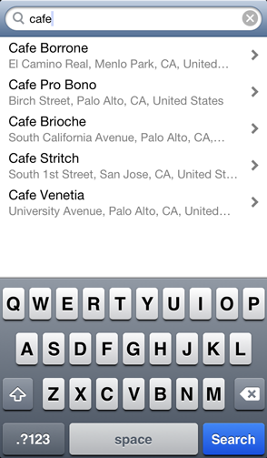
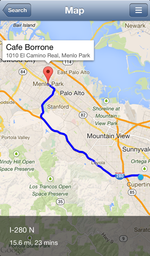

#TCPhotos500px




This sample project demonstrates using 500px's API to view and filter public photo streams.
It displays the thumbnails from the photo stream in a standard UICollectionView. When a thumbnail is 
selected, it will zoom in to display the photo in an overlay modal view. Dismissing the photo will zoom it back out to the thumbnail.

###Features
* Asynchronously fetches a page of photos only when needed.
* Custom overlay modal view to display the large size photo, instead of opening in full screen.
* Tap-to-dismiss gesture for overlay modal view.
* Custom zoom in and out transition animation for presenting and dismissing the overlay modal view.
* "Pull-to-Refresh" to get the latest photos from 500px's photo stream.
* Minimalist UI built using FlatUIKit.
* Supports all device orientations.
* Uses iOS 6's Auto Layout features to make it easier to transition to iOS 7.
* Full source code provided and project files are organised clearly in a MVC structure.

###How to Build
<dl>
  <dt>Build Requirements</dt>
  <dd>Xcode 4.6 or later, iOS 6.0 SDK or later, CocoaPods</dd>
  <dt>Runtime Requirements</dt>
  <dd>iOS 6.0 or later, iPad only</dd>
</dl>

1. Install [CocoaPods](http://cocoapods.org/) (if you have not done so yet).
2. Run from the Terminal: ```pod install```
3. Open ```TCPhotos500px.xcworkspace```

###Open Source Libraries Used
* 500px API - [https://github.com/500px/500px-iOS-api](https://github.com/500px/500px-iOS-api)
* SDWebImage - [https://github.com/rs/SDWebImage](https://github.com/rs/SDWebImage)
* MBProgressHUD - [https://github.com/jdg/MBProgressHUD](https://github.com/jdg/MBProgressHUD)
* SVPullToRefresh - [https://github.com/samvermette/SVPullToRefresh](https://github.com/samvermette/SVPullToRefresh)
* FlatUIKit - [https://github.com/Grouper/FlatUIKit](https://github.com/Grouper/FlatUIKit)

###See Also
* 500px for Developers - [http://developers.500px.com/](http://developers.500px.com/)
* 500px API Docs - [https://github.com/500px/api-documentation](https://github.com/500px/api-documentation)

###License
This project's source code is provided for educational purposes only. See the LICENSE file for more info.
